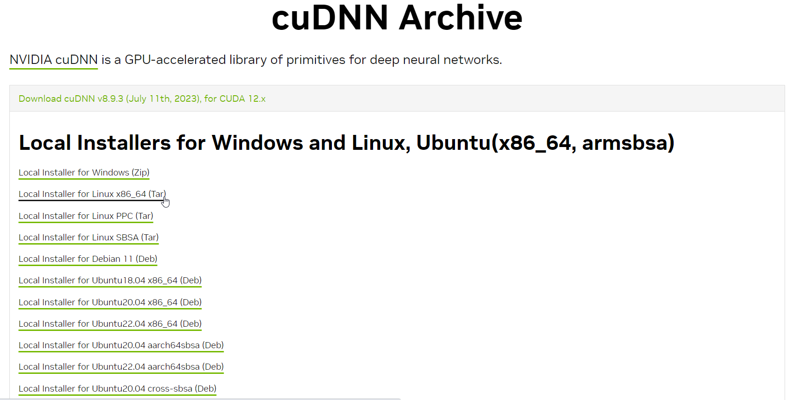

# Установка KubeFlow с помощью Kustomize

<!-- toc -->
- [1. Установка необходимого окружения](#1-установка-необходимого-окружения)
  * [1.1. Установка драйверов NVIDIA](#11-установка-драйверов-nvidia)
  * [1.2. Установка CUDA](#12-установка-cuda)
  * [1.3. Установка CUDNN](#13-установка-cudnn)
  * [1.4. Проверка правильности установки](#14-проверка-правильности-установки)
  * [1.5. Установка nvitop (опционально)](#15-установка-nvitop-опционально)
- [2. Конфигурация кластера](#2-конфигурация-кластера)
  * [2.1. Установка MicroKBs](#21-установка-microkbs)
  * [2.1. Добавление NFS-хранилища](#21-добавление-nfs-хранилища)
- [3. Установка KubeFlow](#3-установка-kubeflow)
  * [3.1. Установка Kustomize](#31-установка-kustomize)
  * [3.2. Установка KubeFlow](#32-установка-kubeflow)
  * [3.2. Создание  Jupyter Notebook (опционально)](#32-создание-jupyter-notebook-опционально)
  * [3.3. Работа с lnference Service](#33-работа-с-lnference-service)
- [4. Обход Dex при обращении к lnference 5ervice](#4-обход-dex-при-обращении-к-lnference-5ervice)
- [5. Изменение имени хоста в lnference Service](#5-изменение-имени-хоста-к-lnference-service)
- [6. Изменение логина и пароля в KubeFlow](#6-изменение-логина-и-пароля-к-kubeflow)
- [7. Изменение ConfigMap (опционально)](#7-изменение-configmap-опционально)
- [8. Получение токена и сертификата для доступа к кластеру](#8-получение-токена-и-сертификата-для-доступа-к-кластеру)
- [9. Grafana (опционально)](#9-grafana-опционально)
  * [9.1. Развернуть Grafana и Prometheus](#91-развернуть-grafana-и-prometheus)
  * [9.2. Развернуть Exporter для сбора метрик GPU](#92-развернуть-exporter-для-сбора-метрик-gpu)
  * [9.3. Обеспечить доступ к Grafana извне](#93-обеспечить-доступ-к-grafana-извне)
  * [9.4. Настройка Grafana Dashboard](#94-настройка-grafana-dashboard)
- [10. Добавление и удаление узлов в кластере](#10-добавление-и-удаление-узлов-к-кластере)
  * [10.1. Добавление узла](#101-добавление-узла)
  * [10.2. Удаление узла](#102-удаление-узла)
- [11. Очистка ПК](#11-очистка-пк)
  * [11.1. Сохранение файлов из Default Storage](#111-сохранение-файлов-из-default-storage)
  * [11.2. Удаление текущей версии Kubernetes](#112-удаление-текущей-версии-kubernetes)
  * [11.3. Удаление CUDA](#113-удаление-cuda)
  * [11.4. Удаление драйверов NVIDIA](#114-удаление-драйверов-nvidia)
  * [11.5. Удаление ненужных репозиториев](#115-удаление-ненужных-репозиториев)
  * [11.6. Очистка системы от удалённых пакетов](#116-очистка-системы-от-удалённых-пакетов)
  * [11.7. Удалить Docker (опционально)](#117-удалить-docker-опционально)
- [Приложение А. Управление контейнерами в crt](#приложение-а-управление-контейнерами-в-crt)
<!-- tocstop -->

**Внимание**: На момент написания этого документа (06.09.2023) устройства **GPU** успешно обнаруживаются **Kubernetes** только на операционной системе (ОС) **Ubuntu 20.04**. На других версиях ОС **Kubernetes** может не обнаружить **GPU**! В настоящий момент поддерживаются только **GPU** **NVIDIA**.


## 1. Установка необходимого окружения


### 1.1. Установка драйверов NVIDIA

Добавление PPA репозитория:

```bash
sudo add-apt-repository ppa:graphics-drivers/ppa
sudo apt update
sudo apt upgrade
```

Проверка доступных драйверов:

```bash
ubuntu-drivers devices
```

Вывод команды должен быть похож на следующий:

```bash
modalias : pci:v000010DEd00002204sv00001569sd00002204bc03sc00i00
vendor   : NVIDIA Corporation
driver   : nvidia-driver-535-open - distro non-free
driver   : nvidia-driver-525-open - distro non-free
driver   : nvidia-driver-535 - distro non-free
driver   : nvidia-driver-525-server - distro non-free
driver   : nvidia-driver-470 - distro non-free
driver   : nvidia-driver-535-server-open - distro non-free recommended
driver   : nvidia-driver-470-server - distro non-free
driver   : nvidia-driver-535-server - distro non-free
driver   : nvidia-driver-525 - distro non-free
driver   : xserver-xorg-video-nouveau - distro free builtin
```

Лучше устанавливать последнюю версию драйвера, в данном случае это `nvidia-driver-535 - distro non-free`.

**Примечание:** Приписка `-open`  обозначает, что драйвер с открытым исходным кодом. Отсутствие данной приписки обозначает обычную проприетарную версию драйвера. **NVIDIA** рекомендуют использовать проприетарный драйвер для достижения лучшей производительности.

Установка требуемого драйвера

```bash
sudo apt install nvidia-driver-535
```

**Внимание**: Для видеокарты **Nvidia Tesla K80** последняя поддерживаемая версия драйвера **470.82**!

### 1.2. Установка CUDA

Скачать требуемую версию CUDA с официального сайта Nvidia https://developer.nvidia.com/cuda-toolkit-archive.

Далее необходимо выбрать версию ОС и тип инсталлятора. В качестве инсталлятора рекомендуется выбирать локальный (**runfile (local)**).


**Внимание**: Необходимо убедиться, что предлагаемая версия **CUDA** имеет ту же версию драйвера, что и установленная в п. 1.1. В данном случае это версия **535**. Она указана в пути к файлу (`cuda_12.2.1_535.86.10_linux.run`).

**Примечание**: Для видеокарты **Nvidia Tesla K80** последняя поддерживаемая версия **CUDA 11.4.4**!

Чтобы скачать файл нужно выполнить предлагаемую команду:

```bash
wget https://developer.download.nvidia.com/compute/cuda/12.2.1/local_installers/cuda_12.2.1_535.86.10_linux.run
```

После скачивания файла нужно запустить установку, выполнив команду:

```bash
sudo sh cuda_12.1.1_530.30.02_linux.run
```

При установке убрать галочку установки драйвера, т.к. он уже установлен на предыдущем шаге.

После установки **CUDA** нужно сделать её видимой для ОС, добавив пути конфигурационные файлы каталога `/etc`.

Указать путь к исполняемым файлам **CUDA** в файле `/etc/environment`:

```bash
sudo nano /etc/environment
```

добавив путь `/usr/local/cuda/bin`:

```bash
PATH="/usr/local/sbin:/usr/local/bin:/usr/sbin:/usr/bin:/sbin:/bin:/snap/bin:/usr/local/cuda/bin"
```

Переменные окружения, созданные в `/etc/environment` доступны для всей системы, для каждого пользователя и даже при удаленном подключении.

Далее нужно создать файл конфигурации `cuda-xx-x.conf` в каталоге `/etc/ld.so.conf.d`, где `xx-x` - установленная версия **CUDA**, в нашем примере - `12-2`:

```bash
sudo nano /etc/ld.so.conf.d/cuda-12-2.conf
```

и добавить в него пути:

```bash
/usr/local/cuda-12.2/targets/x86_64-linux/lib
/usr/local/cuda-12.2/lib64
/usr/local/cuda-12.2/extras/CUPTI/lib64
```

Этот файл указывает системе где искать совместно используемые библиотеки **CUDA**.

Для пользователя указать переменные среды в самом конце файла `.bashrc`:

```bash
sudo nano ~/.bashrc
```

```bash
export LD_LIBRARY_PATH=/usr/local/cuda/lib64${LD_LIBRARY_PATH:+:${LD_LIBRARY_PATH}}
export CUDA_HOME=/usr/local/cuda
export PATH="$HOME/.local/bin:$PATH"
```

Это переменные добавляют пути поиска библиотек и исполняемых файлов для локального пользователя.

### 1.3. Установка CUDNN

**CUDNN** представляет собой библиотеку примитивов для глубоких нейронных сетей с графическим ускорением. **CUDNN** обеспечивает оптимизированную реализацию многих распространенных операций глубокого обучения. Эти оптимизированные реализации могут значительно ускорить обучение и запуск глубоких нейронных сетей на графических процессорах **NVIDIA**.

Скачать требуемую версию **CUDNN** можно по ссылке https://developer.nvidia.com/rdp/cudnn-archive.

**Внимание**: Версия **CUDNN** должна быть совместима с установленной версией **CUDA**!

Далее выбрать `Local installer for linux x86_64 (Tar)` - скачиваемый tar-архив для локальной установки.

**Примечание**: Для скачивания **CUDNN** необходимо наличие регистрации на сайте **NVIDIA**.



**Примечание**: Для видеокарты **Nvidia Tesla K80** последняя поддерживаемая версия **CUDNN 8.2.4**!

После скачивания архива, для установки **CUDNN** нужно следовать официальной документации https://docs.nvidia.com/deeplearning/cudnn/install-guide/index.html...

Распаковать:

```bash
tar -xvf cudnn-linux-x86_64-8.9.1.23_cuda12-archive.tar.xz
```

Скопировать файлы библиотеки в каталоги CUDA:

```bash
sudo cp cudnn-*-archive/include/cudnn*.h /usr/local/cuda/include
sudo cp -P cudnn-*-archive/lib/libcudnn* /usr/local/cuda/lib64
```

Сделать добавленные файлы доступными для чтения:

```bash
sudo chmod a+r /usr/local/cuda/include/cudnn*.h /usr/local/cuda/lib64/libcudnn*
```

### 1.4. Проверка правильности установки

```
nvidia-smi
```

Вывод должен содержать информацию о видеокарте, драйвере и версии **CUDA**. В нашем примере это `535.86` и `12.2` соответственно:

```bash
Wed Sep  6 15:48:52 2023      
+---------------------------------------------------------------------------------------+
| NVIDIA-SMI 535.86.10              Driver Version: 535.86.10    CUDA Version: 12.2     |
|-----------------------------------------+----------------------+----------------------+
| GPU  Name                 Persistence-M | Bus-Id        Disp.A | Volatile Uncorr. ECC |
| Fan  Temp   Perf          Pwr:Usage/Cap |         Memory-Usage | GPU-Util  Compute M. |
|                                         |                      |               MIG M. |
|=========================================+======================+======================|
|   0  NVIDIA GeForce RTX 4090        Off | 00000000:06:00.0 Off |                  Off |
|  0%   36C    P8              11W / 450W |     31MiB / 24564MiB |      0%      Default |
|                                         |                      |                  N/A |
+-----------------------------------------+----------------------+----------------------+
                                                                                        
+---------------------------------------------------------------------------------------+
| Processes:                                                                            |
|  GPU   GI   CI        PID   Type   Process name                            GPU Memory |
|        ID   ID                                                             Usage      |
|=======================================================================================|
|    0   N/A  N/A      1353      G   /usr/lib/xorg/Xorg                            9MiB |
|    0   N/A  N/A      1726      G   /usr/bin/gnome-shell                          8MiB |
+---------------------------------------------------------------------------------------+

```

При возникновении ошибок попробовать перезапустить ПК:

```bash
sudo reboot
```

### 1.5.  Установка nvitop (опционально)

Для интерактивного просмотра процессов NVIDIA-GPU существуют библиотека Python под названием **nvitop**.

Чтобы её установить нужен менеджер пакетов pip. Для его установки в Ubuntu необходимо выполнить команду

```bash
sudo apt install python3-pip
```

Далее с помощью пакетного менеджера pip установить nvitop:

```bash
pip install nvitop
```

Для её корректной работы нужно добавить путь `~/.local/bin` в переменную среды PATH. Это сделано на шаге 1.2, когда в файл ~/.bashrc добавили строчку `export PATH="$HOME/.local/bin:$PATH"`.

Для вывода результатов достаточно в консоли прописать команду

```bash
nvitop
```

Вывод должен содержать информацию о видеокарте, драйвере и версии CUDA использование памяти, загруженность и многое другое в интерактивном режиме:


## 2. Конфигурация кластера

### 2.1. Установка MicroK8s

**MicroK8s** — это самый простой и быстрый способ запустить **Kubernetes**. **MicroK8s** предоставляет все возможности **Kubernetes** с помощью одной команды: развернуть кластер включить необходимые службы. Полностью изолированный snap-пакет развертывания защищает базовую систему.

**Kubeflow** — это набор инструментов машинного обучения для **Kubernetes**, представляющий собой набор независимых компонент, интегрированных в единую систему.


**Kubeflow** позволяет запускать **Jupyter**-ноутбуки, создавать рабочие процессы выполнения в виде pipeline'ов, производить обучение моделей, осуществлять подбор гиперпараметров, а также развёртывать обученные модели в виде сервисов. Например, развёртывание моделей осуществляется с помощью отдельного сервиса **KServe**.


На текущий момент **Kubeflow** несовместим с версией **Kubernetes 1.22** и выше (https://github.com/kubeflow/manifests).

Версия **MicroK8S 1.21** имеет проблемы с поддержкой GPU (https://github.com/canonical/microk8s/issues/3226#issuecomment-1150073929) из-за используемой версией GPU operator.

Версия **MicroK8S 1.20** использует **NVIDIA Plugin** вместо **GPU operator**, поддерживает GPU, совместим с **KubeFlow**

**Внимание:** **MicroK8S 1.20** конфликтует с **nvidia-docker2** (https://github.com/ubuntu/microk8s/issues/1844#issuecomment-750760506)!

Установить **MicroK8S** версии **1.20/stable** можно с помощью команды:

```bash
sudo snap install microk8s --classic --channel=1.20/stable
```

Проинициализировать **MicroK8S**:

```bash
microk8s inspect
microk8s status
```

Включить dns (внутреннюю сеть) и storage (хранилище для данных кластера):

```bash
microk8s enable dns storage
```

Включить поддержку GPU:

```bash
microk8s enable gpu
```

Проверить инициализацию:

```bash
microk8s status
```

Вывод команды должен быть следующим:

```bash
microk8s is running
high-availability: no
  datastore master nodes: 192.168.21.48:19001
  datastore standby nodes: none
addons:
  enabled:
    dns                  # CoreDNS
    gpu                  # Automatic enablement of Nvidia CUDA
    ha-cluster           # Configure high availability on the current node
    storage              # Storage class; allocates storage from host directory
  disabled:
    ambassador           # Ambassador API Gateway and Ingress
    cilium               # SDN, fast with full network policy
    dashboard            # The Kubernetes dashboard
    fluentd              # Elasticsearch-Fluentd-Kibana logging and monitoring
    helm                 # Helm 2 - the package manager for Kubernetes
    helm3                # Helm 3 - Kubernetes package manager
    host-access          # Allow Pods connecting to Host services smoothly
    ingress              # Ingress controller for external access
    istio                # Core Istio service mesh services
    jaeger               # Kubernetes Jaeger operator with its simple config
    keda                 # Kubernetes-based Event Driven Autoscaling
    knative              # The Knative framework on Kubernetes.
    kubeflow             # Kubeflow for easy ML deployments
    linkerd              # Linkerd is a service mesh for Kubernetes and other frameworks
    metallb              # Loadbalancer for your Kubernetes cluster
    metrics-server       # K8s Metrics Server for API access to service metrics
    multus               # Multus CNI enables attaching multiple network interfaces to pods
    portainer            # Portainer UI for your Kubernetes cluster
    prometheus           # Prometheus operator for monitoring and logging
    rbac                 # Role-Based Access Control for authorisation
    registry             # Private image registry exposed on localhost:32000
    traefik              # traefik Ingress controller for external access

```

Для проверки поддержки **GPU** можно запросить список ресурсов узла, выполнив команду:

```bash
microk8s kubectl get node -o jsonpath="{range .items[*]}{..allocatable}{'\n'}{end}"
```

Ответ должен содержать запись вида `"nvidia.com/gpu":"xxx"`, где `xxx` - количество GPU:

```
{"cpu":"8","ephemeral-storage":"478030536Ki","hugepages-1Gi":"0","hugepages-2Mi":"0","memory":"32705760Ki","nvidia.com/gpu":"1","pods":"110"}
```

### 2.1. Добавление NFS-хранилища

NFS-хранилище предоставляет возможность хранения данных в единой сетевой папке. Это особенно удобно, когда кластер состоит из нескольких ПК (нод, узлов). Наличие NFS-хранилища упрощает хранение моделей и доступ к ним из единого места, избавляя от необходимости дублирования копий на нескольких узлах.

#### 2.1.1. Настройка NFS-сервера

Сначала необходимо установить пакет `nfs-kernel-server`

```bash
sudo apt install nfs-kernel-server
```

Далее нужно создать каталог, где будет располагаться хранилище.

```bash
sudo mkdir /mnt/nfs -p
```

Для безопасности NFS преобразует любые операции **root** на **клиенте** в операции с учетными данными `nobody:nogroup`. В связи с этим, необходимо изменить владельца каталога для соответствия этим учетным данным.

```bash
sudo chown nobody:nogroup /mnt/nfs
```

Настройка общего доступа осуществляется с помощью конфигурационного файла `/etc/exports`.  Откроем его для редактирования:

```bash
sudo nano /etc/exports
```

Синтаксис выглядит следующим образом:

```
directory_to_share client_ip(option_1,...,option_N)
```

Нужно создать строку для каждого каталога, к которому предоставляется общий доступ. Ниже представлены основные обозначения и опции:

- `directory_to_share` - путь к директории, которую нужно сделать доступной по сети.
- `client_ip`  IP-адрес или диапазон адресов, которые могут получить доступ к папке.

- `rw` - доступ **клиену** к чтению и записи на соответствующем томе.
- `sync` - принудительно заставляет NFS записывать изменения на диске, прежде чем отправлять ответ. В результате мы получается более стабильная работа, поскольку в ответе отражается фактическое состояние удаленного тома. Однако при этом снижается скорость операций с файлами.
- `async` - не блокировать подключения пока данные записываются на диск.
- `no_subtree_check` - предотвращает проверку вложенного дерева, когда **хост** проверяет фактическую доступность файла в экспортированном дереве при каждом запросе. Это может вызвать много проблем в случае переименования файла, когда он открыт **на клиентской** системе. Проверку вложенного дерева в большинстве случаев лучше отключить.
- `subtree_check` - проверять не пытается ли пользователь выйти за пределы экспортированной папки.
- `no_root_squash`: по умолчанию NFS преобразует запросы удаленного пользователя **root** в запросы пользователя без привилегий на сервере. Это предназначено для обеспечения безопасности, чтобы пользователь **root** **клиентской** системы не мог использовать файловую систему **хоста** с правами **root**. Опция `no_root_squash` отключает такое поведение для определенных общих ресурсов.
- `root_squash` - подменять запросы от root на анонимные, используется по умолчанию.

- `anonuid` и `anongid` - указывает user-ID (UID) и group-ID (GID) для анонимного пользователя.
- `secure` - использовать для соединения только порты ниже 1024.
- `insecure` - использовать любые порты.
- `nohide` - не скрывать поддиректории при, открытии доступа к нескольким директориям.

UID анонимного пользователя можно узнать в файле `/etc/passwd` или выполнив команду

```bash
cat /etc/passwd | grep nobody
```

GID для анонимного пользователя можно узнать в файле `/etc/group` или выполнив команду

```bash
cat /etc/group | grep nogroup
```

Для сети Megaputer конфигурация выглядит следующим образом.

```bash
/mnt/nfs 192.168.20.0/22(rw,sync,insecure,nohide,no_root_squash,anonuid=65534,anongid=65534,no_subtree_check)
```

Адрес `192.168.20.0/22` задаёт диапазон адресов от `192.168.20.1`  до  `192.168.23.254`, которые будут иметь доступ к NFS-хранилищу.

Чтобы сделать общие ресурсы доступными для настроенных клиентов, нужно перезапустить сервер NFS с помощью команды:

```bash
sudo systemctl restart nfs-kernel-server
```

#### 2.1.2. Добавление NFS-хранилища

Включить **Helm** в **MicroK8S**:

```bash
microk8s enable helm3
```

**Примечание:** Лучше активировать **Helm3**, т.к. при использовании просто **Helm** может возникнуть ошибка отсутствия **Tiller**.

Следовать [инструкциям](https://github.com/kubernetes-sigs/nfs-subdir-external-provisioner):

```bash
microk8s helm3 repo add nfs-subdir-external-provisioner https://kubernetes-sigs.github.io/nfs-subdir-external-provisioner/
microk8s helm3 install nfs-subdir-external-provisioner nfs-subdir-external-provisioner/nfs-subdir-external-provisioner \
    --set nfs.server=x.x.x.x \
    --set nfs.path=/exported/path
```

где `x.x.x.x` - IP-адрес узла, а `/exported/path` - путь к папке NFS-хранилища (в нашем примере `/mnt/nfs`)

Проверить компоненты **StorageClass** в кластере с помощью команды:

```bash
microk8s kubectl get storageclass
```

Вывод должен быть таким:

```bash
NAME                          PROVISIONER                                     RECLAIMPOLICY   VOLUMEBINDINGMODE   ALLOWVOLUMEEXPANSION   AGE
microk8s-hostpath (default)   microk8s.io/hostpath                            Delete          Immediate           false                  24h
nfs-client                    cluster.local/nfs-subdir-external-provisioner   Delete          Immediate           true                   24h
```

В кластере уже присутствует хранилище **storage**, которое было развёрнуто в разделе 2.1, которое является [хранилищем данных по умолчанию](https://kubernetes.io/docs/tasks/administer-cluster/change-default-storage-class/) (**Default Storage Class**). При развёртывании **NFS**-хранилища возможно ему также была присвоена метка хранилища по умолчанию, что может привести к конфликтам. В частности при создании блокнота (**Jupyter Notebook**) в **Kubeflow** для хранения сопутствующих данных указывается хранилище по умолчанию. При наличии двух таких хранилищ возникает конфликт и вывод будет таким:

```bash
NAME                          PROVISIONER                                         RECLAIMPOLICY   VOLUMEBINDINGMODE   ALLOWVOLUMEEXPANSION   AGE
microk8s-hostpath (default)   microk8s.io/hostpath                                Delete          Immediate           false                  3d11h
nfs-client (default)          cluster.local/nfs-nfs-subdir-external-provisioner   Delete          Immediate           true                   3d11h
```

Тогда для хранилища `nfs-client` нужно убрать флаг **default**. Делается это командой

```bash
microk8s kubectl patch storageclass nfs-client -p '{"metadata": {"annotations":{"storageclass.kubernetes.io/is-default-class":"false"}}}'
```

## 3. Установка KubeFlow

### 3.1. Установка Kustomize

Установка **KubeFlow** осуществляется с помощью **Kustomize**. Наиболее актуальная версия **Kustomize**, поддерживаемая **Kubeflow**  является **3.2.0** (https://github.com/kubeflow/manifests).

Скачать **Kustomize 3.2.0** можно с помощью команды

```bash
wget https://github.com/kubernetes-sigs/kustomize/releases/download/v3.2.0/kustomize_3.2.0_linux_amd64
```

Установка заключается в помещении исполняемого файла в папку `/usr/local/bin` и предоставлении разрешения для его исполнения:

```bash
chmod +x kustomize_3.2.0_linux_amd64
sudo mv kustomize_3.2.0_linux_amd64 /usr/local/bin/kustomize
```

### 3.2. Установка KubeFlow

На текущий момент самая последняя версия **Kubeflow 1.8**, но на данный момент имеется проблема с авторизацией и получения сессии для последующего дотупа к **Inference Services** (https://github.com/kubeflow/manifests/issues/2542). Поэтому рекомендуется развернуть версию **Kubeflow 1.5**.

Клонировать репозиторий **KubeFlow 1.5**:

```bash
git clone -b v1.5 https://github.com/yurkov-mv/kubeflow-manifests.git
```

Для авторизации в **Kubeflow** используется **Dex**. По умолчанию используются  адрес электронной почты `user@megaputer.com` и пароль `11111111`. Их можно изменить после развёртывания **Kubeflow**, но удобнее это сделать заранее.

Чтобы установить новые адрес электронной почти и пароль нужно отредактировать файл `~/manifests/common/dex/base/config-map.yaml`. В целях безопасности пароль в файле хранится в хэшированном виде. Чтобы получить хэш для своего пароля можно воспользоваться функцией `bcrypt` из библиотеки **Python** **Passlib** :

```bash
python3 -c 'from passlib.hash import bcrypt; import getpass; print(bcrypt.using(rounds=12, ident="2y").hash(getpass.getpass()))'
```

После введения вышеприведённой команды поступит приглашение ввести пароль. Введите пароль и нажмите `Enter`, в терминале появится строка с хэшем.

Замечание: Возможно понадобится установить библиотеку `passlib` через пакетной менеджер **pip**:

```bash
pip install passlib
```

Далее в файле `~/manifests/common/dex/base/config-map.yaml` изменяем адрес электронной почты и хэш пароля на свои:

```yaml
  ...
    staticPasswords:
    - email: user@megaputer.com
      hash: $2y$12$4K/VkmDd1q1Orb3xAt82zu8gk7Ad6ReFR4LCP9UeYE90NLiN9Df72
```

По умолчанию пользовательское пространство имён (namespace) в **KubeFlow** задано как `kubeflow-megaputer`. В этом пространстве имён будут создаваться **Inference Service** и оно будет содержаться в адресе при обращении к нему. Чтобы изменить название необходимо отредактировать файл `~/manifests/common/user-namespace/base/params.env` и изменить в нём поле `user` на адрес электронной почты из предыдущего шага, а поле `profile-name` на предпочтительное:

```ini
user=user@megaputer.com
profile-name=kubeflow-megaputer
```

Для того, чтобы указать внешний порт для обращения к кластеру нужно изменить файл `~/manifests/common/istio-1-11/istio-install/base/patches/service.yaml`   следующим образом:

```yaml
apiVersion: v1
kind: Service
metadata:
  name: istio-ingressgateway
  namespace: istio-system
spec:
  ports:
  - name: http2
    nodePort: 31368
    port: 80
    protocol: TCP
    targetPort: 8080
  type: NodePort
```

, где 31368 - номер внешнего порта, который должен лежать в диапазоне 31000 - 33000.

Установить **KubeFlow** с помощью **Kustomize**:

```bash
while ! kustomize build ~/kubeflow-manifests/example | microk8s kubectl apply -f -; do echo "Retrying to apply resources"; sleep 10; done
```

Убедиться в правильности установки можно с помощью наблюдения за **POD**'ами.

```bash
watch -c microk8s kubectl get pods -n kubeflow
```

Все они должны быть в состоянии `Running`:

```
NAME                                                         READY   STATUS    RESTARTS   AGE
kubeflow-pipelines-profile-controller-84bcbdb899-tjwhx       1/1     Running   6          16d
volumes-web-app-deployment-87484c848-4xs6m                   1/1     Running   5          16d
katib-ui-f787b9d88-64ct7                                     1/1     Running   5          16d
katib-mysql-6dcb447c6f-gzwl5                                 1/1     Running   5          16d
kserve-controller-manager-0                                  2/2     Running   12         16d
katib-controller-58ddb4b856-4wxf9                            1/1     Running   5          16d
jupyter-web-app-deployment-5886974887-ctmpr                  1/1     Running   5          16d
metacontroller-0                                             1/1     Running   5          16d
admission-webhook-deployment-7df7558c67-cjgpm                1/1     Running   5          16d
metadata-envoy-deployment-86d856fc6-jzsc5                    1/1     Running   5          16d
training-operator-7b8cc9865d-p6xdx                           1/1     Running   8          16d
cache-server-5bdbd59959-qsswj                                2/2     Running   10         16d
kserve-models-web-app-5c64c8d8bb-948dw                       2/2     Running   12         16d
profiles-deployment-5cdc5dc577-tgv25                         3/3     Running   31         16d
ml-pipeline-persistenceagent-7bf47b869c-xhbf9                2/2     Running   11         16d
centraldashboard-5dd4f57bbd-h4stl                            2/2     Running   10         16d
minio-5b65df66c9-xmrcg                                       2/2     Running   10         16d
ml-pipeline-visualizationserver-6c7945497b-58r4l             2/2     Running   10         16d
ml-pipeline-viewer-crd-68bcdc87f9-zzsxh                      2/2     Running   24         16d
ml-pipeline-ui-779887656c-htch5                              2/2     Running   10         16d
tensorboards-web-app-deployment-7c5db448d7-9zxzj             1/1     Running   5          16d
katib-db-manager-6df878f5b8-6pxm8                            1/1     Running   6          16d
ml-pipeline-scheduledworkflow-565fd7846-cbp5w                2/2     Running   12         16d
mysql-f7b9b7dd4-wkqg5                                        2/2     Running   10         16d
notebook-controller-deployment-6c5f5d6cfc-bhpzn              2/2     Running   24         16d
metadata-writer-d7ff8d4bc-xrmlw                              2/2     Running   13         16d
ml-pipeline-cb7dcd54b-5v7vh                                  2/2     Running   19         16d
metadata-grpc-deployment-6f6f7776c5-8pblm                    2/2     Running   23         16d
tensorboard-controller-controller-manager-5cbddb7fb5-zr9nm   3/3     Running   2767       16d
workflow-controller-6bf87db995-nl9cn                         2/2     Running   2689       16d
```

После того, как все будет успешно установлено нужно узнать порт по котрому можно получить доступ к центральной панели. Это можно сделать обратившись к ресурсу `istio-ingressgateway` в пространстве имён `istio-system`:

```bash
microk8s kubectl get service istio-ingressgateway -n istio-system
```

Вывод должен содержать информацию о соответствии внутренних и внешних портов (port-forwarding):

```bash
NAME                   TYPE       CLUSTER-IP       EXTERNAL-IP   PORT(S)                                                                      AGE
istio-ingressgateway   NodePort   10.152.183.181   <none>        15021:32693/TCP,80:31368/TCP,443:30303/TCP,31400:31034/TCP,15443:31551/TCP   24h
```

 В приведённом выше примере порту **80** в кластере соответствует внешний порт **31368**. Теперь можно войти в центральную панель управления, набрав в браузере адрес

```bash
http://127.0.0.1:31368/
```

**Внимание:** Для осуществления настроек лучше заходить через локальный адрес (127.0.0.1), иначе при применении настроек можно получить ошибку

```bash
[403] Could not find CSRF cookie XSRF-TOKEN in the request.
```

Ошибка возникает, т.к. подклюаение производится через обычный http, что предотвращает установку файла *cookie*. А для внесения изменений извне требует наличие данного cookie-файла для защиты от атаки "человек посередине".

### 3.2. Создание  Jupyter Notebook (опционально)

**Jupyter**-блокноты позволяют выполнять python-команды и команды bash для развёртывания и анализа сервисов моделей,  а также одновременно удобно хранить исполняемые команды совместно с их текстовым описанием.


Для создания **Jupyter**-ноутбука лучше использовать заранее подготовленный `Custom Image`, где уже предустановлены все необходимые библиотеки. Образом, содержащем **python**-библиотеку `kserve` является, например, `yurkoff/jupyter-scipy:v1.4`.

### 3.3. Работа с Inference Service

Работа с  **Inference Service** с помощью **Jupyter**-блокнота и yaml-файлов описана в документе [Inference Services](./docs/InferenceServices.md).

## 4. Обход Dex при обращении к Inference Service

При обращении к сервисам **KServe**, развёрнутым в **Kubflow** требуется авторизация, осуществляемая через сервис **Dex**. Иногда это может стать проблемой особенно при обращении из множества источников, т.к. начальное обращение требует получения сессии. Одним из решением этой проблемы является обход аутентификации **Dex** при обращении к сервисам.

**Kubeflow** через ресурс **VirtualService** настраивает, что весь трафик через общий шлюз **Istio Ingress Gateway** проходит через **EnvoyFilter** авторизации запросов.  **EnvoyFilter** направляет входящий трафик в [OIDC AuthService](https://github.com/arrikto/oidc-authservice) , который проверяет файл *cookie* авторизации и может либо разрешить выполнение запроса, либо отклонить его из-за недействительной авторизации, либо инициировать рабочий процесс аутентификации с помощью внешней системы, такой как [Dex](https://dexidp.io/) .

Для обхода **Dex** следует избавиться от входного **EnvoyFilter**, а вместо него использовать **External Authorization** от **Istio**. Весь трафик, за исключением трафика предназначенного для **Inference Service**'ов направлять на авторизацию посредством **Authorization Policy** от **Istio**.


Для начала добавим внешнюю авторизацию, отредактировав файл `configmap` в пространстве имён `istio-system`

```bash
microk8s kubectl edit configmap istio -n istio-system
```

и добавив в него информацию, связанную с **Dex**:

```yaml
...
    extensionProviders:
    - name: "dex-auth-provider"
      envoyExtAuthzHttp:
        service: "authservice.istio-system.svc.cluster.local"
        port: "8080"
        includeHeadersInCheck: ["authorization", "cookie", "x-auth-token"]
        headersToUpstreamOnAllow: ["kubeflow-userid"]
```

Раздел `data` должен выглядеть следующим образом:

```yaml
data:
  # Configuration file for the mesh networks to be used by the Split Horizon EDS.
  mesh: |-
    accessLogFile: /dev/stdout
    defaultConfig:
      discoveryAddress: istiod.istio-system.svc:15012
      proxyMetadata: {}
      tracing: {}
    enablePrometheusMerge: true
    rootNamespace: istio-system
    tcpKeepalive:
      interval: 5s
      probes: 3
      time: 10s
    trustDomain: cluster.local
    extensionProviders:
    - name: "dex-auth-provider"
      envoyExtAuthzHttp:
        service: "authservice.istio-system.svc.cluster.local"
        port: "8080"
        includeHeadersInCheck: ["authorization", "cookie", "x-auth-token"]
        headersToUpstreamOnAllow: ["kubeflow-userid"]
  meshNetworks: 'networks: {}'
```

Формат обращения к **Inference Service** выглядит следующим образом:

```bash
http://host_ip:host_port/v1/models/model_name:predict
```

- `host_ip` - IP-адрес кластера.
- `host_port` - внешний порт, соответствующий внутреннему порту 80.
- `model_name` - имя модели.

Для успешного обхода **Dex**, нужно создать политику (файл `dex-authorization-policy.yaml`), которая отправляет весь трафик на авторизацию, за исключением адресов, которые начинаются на `/v1`:

```yaml
apiVersion: security.istio.io/v1beta1
kind: AuthorizationPolicy
metadata:
  name: dex-auth
  namespace: istio-system
spec:
  selector:
    matchLabels:
      istio: ingressgateway
  action: CUSTOM
  provider:
    # The provider name must match the extension provider defined in the mesh config.
    name: dex-auth-provider
  rules:
  # The rules specify when to trigger the external authorizer.
  - to:
    - operation:
        notPaths: ["/v1*"]
```

Применить файл политики следующей командой:

```bash
microk8s kubectl apply -f dex-authorization-policy.yaml
```

Далее нужно создать файл **Authorization Policy**  (`allow-inference-services.yaml`) для разрешения прохождения трафика с адресом `/v1` через **Istio Ingress Gateway**

```yaml
apiVersion: security.istio.io/v1beta1
kind: AuthorizationPolicy
metadata:
  name: allow-inference-services
  namespace: istio-system
spec:
  selector:
    matchLabels:
  action: ALLOW
  rules:
  - from:
    - source:
        principals: ["cluster.local/ns/istio-system/sa/istio-ingressgateway-service-account"]
  - to:
    - operation:
        methods: ["POST"]
        paths: ["/v1*"]
```

```bash
microk8s kubectl apply -f allow-inference-services.yaml
```

Теперь можно удалить исходный `authn-filter`

```bash
microk8s kubectl delete -n istio-system envoyfilters.networking.istio.io authn-filter
```

 и перезапустить `istiod`:

```bash
microk8s kubectl rollout restart deployment/istiod -n istio-system
```

## 5. Изменение имени хоста в Inference Service

При обращении к модели в заголовке POST-запроса в поле `Host` требуется указать адрес хоста сервиса, который имеет следующий формат:

```bash
service_name.namespace.example.com
```

- `service_name` - имя **Inference Service**.
- `namespace` - пространство имён, где развёрнут **Inference Service**.
- `example.com` - имя, которое указано в файле `~\manifests\contrib\kserve\kserve\kserve_kubeflow.yaml`

Чтобы изменить имя `example.com` на своё, нужно отредактировать **Config Map** `config-domain` в пространстве имён `knative-serving`:

```bash
microk8s kubectl edit configmap config-domain -n knative-serving
```

Нужно удалить ключ `_example` в поле `data` и написать вместо него желаемое имя в формате `name: ""`. Для `megaputer.com` файл будет выглядить следующим образом:

```yaml
apiVersion: v1
data:
    megaputer.com: ""
    example.org: |
      selector:
        app: nonprofit
...
```

**Knative** согласовывает изменения, внесенные в **Config Map**, и автоматически обновляет имя хоста для всех развернутых сервисов и маршрутов.

## 6. Изменение логина и пароля в KubeFlow

Чтобы изменить логин и пароль в **Dex** после развёртывания **Kubflow** достаточно отредактировать **ConfigMap** `dex` в пространстве имён `auth`

```bash
microk8s kubectl edit configmap dex -n auth
```

и перезапустить **Deployment** `dex`

```bash
microk8s kubectl rollout restart deployment dex -n auth
```

## 7. Изменение ConfigMap (опционально)

```bash
microk8s kubectl edit configmap inferenceservice-config -n kubeflow
```

## 8. Получение токена и сертификата  для доступа к кластеру

Для управления кластером через REST-API необходимо получить токен и сертификат. Делается это с помощью следующих команд:

```bash
APISERVER=$(microk8s kubectl config view --minify -o jsonpath='{.clusters[0].cluster.server}')
SECRET_NAME=$(microk8s kubectl get serviceaccount default -o jsonpath='{.secrets[0].name}')
TOKEN=$(microk8s kubectl get secret $SECRET_NAME -o jsonpath='{.data.token}' | base64 --decode)
echo $TOKEN > /mnt/nfs/token.txt
microk8s kubectl get secrets $SECRET_NAME -n default -o jsonpath='{.data.ca\.crt}' | base64 --decode > /mnt/nfs/ca.crt
```

## 9. Grafana (опционально)

### 9.1. Развернуть **Grafana** и **Prometheus**

**Grafana** - это система для визуализации, мониторинга и анализа данных. Она позволяет пользователям создавать дашборды с панелями, каждая из которых отображает определенные показатели в течение установленного периода времени.

**Prometheus** - это база данных временных рядов, которая нужна для логирования метрик, отображаемых в **Grafana**.

Для включения **Grafana** и **Prometheus** в кластере **MicroK8S** нужно выполнить команду:

```bash
microk8s enable prometheus
```

Чтобы метрики отображались по адресу [http:://{cluster_address}:{cluster_port}/grafana]() и не пересекались с **Dashboard'ом Kubeflow** необходимо проделать ряд действий:

Развернуть хранилище для хранения настроек **Grafana** в пространстве имён **monitoring**:

```bash
microk8s kubectl apply -f ./nvidia/pvc-grafana-settings.yaml --namespace=monitoring
```

Файл **pvc-grafana-settings.yaml** должен иметь следующее содержимое:

```yaml
apiVersion: v1
kind: PersistentVolumeClaim
metadata:
  name: pvc-grafana-settings
spec:
  storageClassName: nfs-client
  resources:
    requests:
      storage: 100Mi
  accessModes:
    - ReadWriteMany
```

В развёрнутое хранилище добавить файл **grafana.ini** со следующим содержимым:

```ini
[server]
root_url = http://127.0.0.1:3000/grafana
serve_from_sub_path = true
```

Далее нужно отредактировать **Deployment** для применения настроек:

```bash
microk8s kubectl edit deployments.apps -n monitoring grafana
```

В файл нужно указать созданное хранилище для настроек...

В разделе **volumeMounts** добавить строчки:

```yaml
        - mountPath: /etc/grafana
          name: grafana-settings
```

В разделе **volumes** добавить строчки:

```yaml
      - name: grafana-settings
        persistentVolumeClaim:
          claimName: pvc-grafana-settings
```

Теперь необходимо перезапустить **Deployment Grafana**:

```bash
microk8s kubectl rollout restart -n monitoring deployment grafana
```

### 9.2. Развернуть **Exporter** для сбора метрик GPU

Для начала нужно склонировать репозиторий https://github.com/utkuozdemir/helm-charts

```bash
git clone https://github.com/utkuozdemir/helm-charts
```

По-умолчанию **nvidia-gpu-exporter** развёртывается на внешнем пору 9835 в качестве **NodePort**. Но т.к. в **Kubeflow** уже развёрнут **Istio**, то развёртывать **nvidia-gpu-exporter** будем как внутренний сервис, а извне он будет доступен по адресу  [http:://{cluster_address}:{cluster_port}/grafana]() благодаря **VirtualService** и **AuthorizationPolicy**. Чтобы этого добиться необходимо произвести ряд манипуляций...

Перейти в папку `nvidia-gpu-exporter` склонированного репозитория.

- Отредактировать файл **values.yaml**. В файле в разделе `service` заменить порт с 9835 на 80 и закомментировать строчку `nodePort`, должно получиться так:

```yaml
service:
  # -- Type of the service
  type: ClusterIP
  # -- Port for the service to use
  port: 80
  # -- The node port to use if service type is NodePort or LoadBalancer.
  # nodePort:
```

- В папке **templates** отредактировать файл **values.yaml**. В файле в разделе `ports` заменить  значение `targetPort` с `http` на `{{ .Values.port }}`, должно получиться так:

```yaml
ports:
    - port: {{ .Values.service.port }}
      targetPort: {{ .Values.port }}
      protocol: TCP
      name: http
      {{- if and (.Values.service.nodePort) (or (eq .Values.service.type "NodePort") (eq .Values.service.type "LoadBalancer")) }}
      nodePort: {{ .Values.service.nodePort }}
      {{- end }}
```

- В папке **templates** отредактировать файл **daemonset.yaml**. В файле в разделе `containers` убрать строчки, связянные с `livenessProbe` и `readinessProbe`:

```yaml
      ports:
        - name: http
          containerPort: {{ .Values.port }}
          protocol: TCP
          {{- if .Values.hostPort.enabled }}
          hostPort: {{ .Values.hostPort.port }}
          {{- end }}
      volumeMounts:
        {{- toYaml .Values.volumeMounts | nindent 12 }}
      resources:
        {{- toYaml .Values.resources | nindent 12 }}
```

Далее развернуть **nvidia-gpu-exporter** следующей коммандой:

```bash
microk8s helm3 install nvidia-gpu-exporter ~/helm-charts/nvidia-gpu-exporter
```

Для сбора метрик системой **Prometheus** необходимо развернуть **ServiceMonitor**. Для этого нужно создать файл **service-monitor.yaml** со следующим содержимым:

```yaml
apiVersion: monitoring.coreos.com/v1
kind: ServiceMonitor
metadata:
  labels:
  name: nvidia-gpu-exporter
  namespace: default
spec:
  endpoints:
  - interval: 30s
    port: http
  selector:
    matchLabels:
      app.kubernetes.io/instance: nvidia-gpu-exporter
```

и развернуть его с помощью комманды

```bash
microk8s kubectl apply -f service-monitor.yaml
```

### 9.3. Обеспечить доступ к Grafana извне

Чтобы можно было наблюдать собранные метрии извне, необходимо натроить сеть **Istio**. Для этого нужно развернуть ресурсы **Gateway**, **VirtualService** и **AuthorizationPolicy** следующего содержания...

**gateway.yaml**

```yaml
apiVersion: networking.istio.io/v1beta1
kind: Gateway
metadata:
  name: nvidia-gateway
  namespace: default
spec:
  selector:
    istio: ingressgateway
  servers:
  - hosts:
    - '*'
    port:
      name: http-port
      number: 80
      protocol: HTTP
```

------

**virtual-service.yaml**

```yaml
apiVersion: networking.istio.io/v1alpha3
kind: VirtualService
metadata:
  name: grafana
  namespace: default
spec:
  gateways:
    - default/nvidia-gateway
  hosts:
  - '*'
  http:
  - match:
    - uri:
        prefix: /grafana
    route:
    - destination:
        host: grafana.monitoring.svc.cluster.local
        port:
          number: 3000

```

------

**authorization-policy.yaml**

```yaml
apiVersion: security.istio.io/v1beta1
kind: AuthorizationPolicy
metadata:
  name: grafana-authorization-policy
  namespace: default
spec:
  selector:
    matchLabels:
  action: ALLOW
  rules:
  - from:
    - source:
        principals: ["cluster.local/ns/istio-system/sa/istio-ingressgateway-service-account"]
  - to:
    - operation:
        methods: ["GET", "POST"]
        paths: ["/grafana*", "/login*"]
```

------

**Gateway** позволяет принимать трафик извне на порт 80. **VirtualService** направляет трафик с **Gateway** (с порта 80 и пути `/grafana`) к сервису **Grafana**. **AuthorizationPolicy** Разрешает поступление трафика извне для путей, начинающихся с `/grafana` и `/login`.

Далее нужно развернуть вышеописанные ресурсы с помощью комманд:

```bash
microk8s kubectl apply -f gateway.yaml
microk8s kubectl apply -f virtual-service.yaml
microk8s kubectl apply -f authorization-policy.yaml
```

### 9.4. Настройка Grafana Dashboard

Теперь можно зайти в **Grafana Dashboard** по адресу http://127.0.0.1:31368/grafana. Логин **admin**, пароль: **admin**.

Далее нужно импортировать Dashboard:

https://grafana.com/grafana/dashboards/14574-nvidia-gpu-metrics/

Отредактировать переменную **gpu**:

```bash
Query: nvidia_smi_index
Regex: /.uuid="(.*)"./
```

В результате по каждой **GPU** можно увидеть её метрики в красивом и удобном формате.


## 10. Добавление и удаление узлов в кластере

### 10.1. Добавление узла

Для добавления нового узла в кластер, нужно установить на добавляемом узле **MicroK8S** и выполнить команду

```bash
microk8s enable gpu
```

На главном узле кластера выполнить команду

```bash
microk8s add-node
```

Данная команда позволяет получить инструкции для добавления узла:

```bash
From the node you wish to join to this cluster, run the following:
microk8s join 192.168.175.77:25000/066502d156d4e98aaca2ef17bd53a94c

If the node you are adding is not reachable through the default interface you can use one of the following:
 microk8s join 192.168.175.77:25000/066502d156d4e98aaca2ef17bd53a94c
 microk8s join 169.254.3.1:25000/066502d156d4e98aaca2ef17bd53a94c
```

Теперь следует выполнить предлагаемую команду `microk8s join ...` на присоединяемом узле. Чтобы убедиться, что узел присоединён нужно выполнить следующую команду:

```bash
microk8s kubectl get nodes
```

Вывод должен быть похож на следующий:

```bash
NAME        STATUS   ROLES    AGE    VERSION
rtx3090-1   Ready    <none>   40d    v1.20.13-35+d877e7a8ac536e
rtx3090-2   Ready    <none>   124d   v1.20.13-35+d877e7a8ac536e
```


### 10.2. Удаление узла

На узле, который нужно удалить, запустите команду

```bash
microk8s leave
```

Чтобы завершить удаление узла, необходимо в кластере вызвать команду

```bash
microk8s remove-node <node name>
```

где `<node name>` имя или IP-адрес узла.

## 11. Очистка ПК

Для того, чтобы откатить ПК к изначальному состоянию нужно произвести ряд манипуляций.

### 11.1. Сохранение файлов из Default Storage

Хранилище **Default Storage** расположен по адресу

```bash
/var/snap/microk8s/common/default-storage
```

В этом каталоге лежит несколько директорий. Например данные **Jypyter Notebook** находятся в каталоге

```bash
kubeflow-megaputer-megaputer-notebook-volume-pvc-d5bf70e5-73cc-4929-a090-3fbefecbec8e
```

- `kubeflow-megaputer` - пространство имён, в котором создан блокнот (указанный в  файле `params.env` при развёртывании **KubeFlow**).
- `megaputer-notebook` - имя блокнота.
- `volume-pvc-d5bf70e5-73cc-4929-a090-3fbefecbec8e` - название хранилища.

Также в **Default Storage** могут находиться пользовательские каталоги, соответствующие созданным **Persistent Volume Claim**.

Все нужные данные лучше перенести в другое удобное для хранения место, т.к. при удалении MicroK8S они также удаляться.

### 11.2. Удаление текущей версии Kubernetes

Сначала нужно остановить работу **MicroK8S** командой:

```bash
microk8s stop
```

После остановки работы MicroK8S можно удалить связанные с ним каталоги:

```bash
sudo snap remove microk8s --purge
sudo rm -rf ~/.kube
```

В случае использования **kubeadm**:

### 11.3. Удаление CUDA

```bash
sudo apt --purge remove "*cublas*" "cuda*" "nsight*"
sudo rm -rf /usr/local/cuda*
sudo rm /etc/apt/sources.list.d/cuda*
```

### 11.4. Удаление драйверов NVIDIA

```
sudo apt --purge remove nvidia*
```

### 11.5. Удаление ненужных репозиториев

При необходимости удалить ранее добавленные репозитории:

```bash
sudo nano /etc/apt/sources.list
sudo ls -la /etc/apt/sources.list.d/
sudo rm -rf /etc/apt/sources.list.d/*
```

### 11.6. Очистка системы от удалённых пакетов

```bash
sudo apt update
sudo apt upgrade
sudo apt autoremove
sudo apt autoclean
```

### 11.7. Удалить Docker (опционально)

Если на ПК ранее был установлен **Docker**, то во избежании конфликта с **MicroK8S** его лучше удалить с помощью следующих команд:

```bash
sudo apt --purge remove "*docker*"
sudo rm -rf /var/lib/docker
sudo rm -rf /var/run/docker.sock
sudo rm -rf /etc/docker
sudo rm -rf /usr/local/bin/docker-compose
sudo rm -rf ~/.docker
```

## Приложение А. Управление контейнерами в crt

Список контейнеров

```bash
microk8s.ctr images list | grep yurkoff
```

Удаление контейнера

```bash
microk8s.ctr images rm docker.io/yurkoff/torchserve-kfs@sha256:b96f45553aded7c5f0c5d887ead9cd5d239390d3a4b516f7939b00ef271176ef
```

Загрузка контейнера в crt

```bash
microk8s ctr image pull docker.io/yurkoff/torchserve-kfs:0.5.3-gpu
microk8s ctr image pull docker.io/yurkoff/torchserve-cuda-11.3-kfs:0.5.3-gpu
microk8s ctr image pull docker.io/yurkoff/torchserve-opencv-cuda-11.3-kfs:0.5.3-gpu
microk8s ctr image pull docker.io/yurkoff/torchserve-kfs:0.7.1-gpu-llm
```

Запуск контейнера

```bash
microk8s ctr run --rm -t --net-host --mount type=bind,src=/home/teslak80/Efremov/torchserve/config/xlmbert,dst=/home/model-server/config,options=rbind:ro --mount type=bind,src=/home/teslak80/Efremov/torchserve/model-store,dst=/home/model-server/model-store,options=rbind:ro docker.io/yurkoff/torchserve:0.1-gpu torchserve
```


```bash
microk8s ctr run --rm -t --net-host --mount type=bind,src=/mnt/nfs/kubeflow-megaputer-torchserve-claim-pvc-0fda373b-34a6-4a24-94c0-743693facc00/bert-multi-cased/config,dst=/home/model-server/config,options=rbind:ro --mount type=bind,src=/mnt/nfs/kubeflow-megaputer-torchserve-claim-pvc-0fda373b-34a6-4a24-94c0-743693facc00/bert-multi-cased/model-store,dst=/home/model-server/model-store,options=rbind:ro docker.io/yurkoff/torchserve-kfs:0.5.3-gpu bert
```

